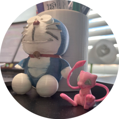
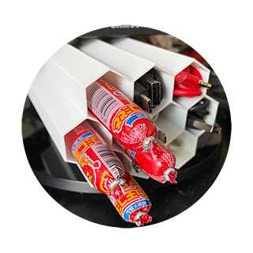

### Hi there 👋

This page contains the 3D printed models I made as well as the excellent models shared on the Internet.

## My 3D Printer

### Anet ET5X

[👉Buy Printer Here👈](https://www.amazon.com/gp/product/B088WP37PN/)

### FlashForge Finder

[👉Buy Printer Here👈](https://www.amazon.com/FlashForge-Finder-Printers-Cloud-connectivity/dp/B016R9E7J2/)

## Mew(Pokemon) 

[👉Mew (Pokemon)👈](https://www.thingiverse.com/thing:4696284) &nbsp;by PatrickFanart December 24, 2020

This thing was created by Thingiverse user PatrickFanart, and is licensed under cc-nc-nd.

## Cable management Hive

[👉Cable management Hive👈](https://www.thingiverse.com/thing:961176) &nbsp;by Filar3D August 08, 2015

This thing was created by Thingiverse user redheelerdog, and is licensed under cc.

