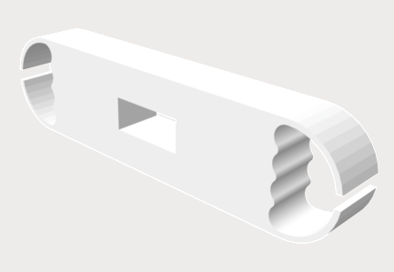

### Hi there 👋

This page contains the 3D printed models I made as well as the excellent models shared on the Internet.

## My 3D Printer

### Anet ET5X

[👉Buy Printer Here👈](https://www.amazon.com/gp/product/B088WP37PN/)

### FlashForge Finder

[👉Buy Printer Here👈](https://www.amazon.com/FlashForge-Finder-Printers-Cloud-connectivity/dp/B016R9E7J2/)

## Mew(Pokemon) 

[👉Mew (Pokemon)👈](https://www.thingiverse.com/thing:4696284) &nbsp;by PatrickFanart December 24, 2020

This thing was created by Thingiverse user PatrickFanart, and is licensed under cc-nc-nd.

## Cable management Hive

[👉Cable management Hive👈](https://www.thingiverse.com/thing:961176) &nbsp;by Filar3D August 08, 2015

This thing was created by Thingiverse user redheelerdog, and is licensed under cc.

## Wasp2_Extender

[👉Buy Flydigi Wasp Series Mobile Game Controller for iPad Here👈](https://www.amazon.com/Flydigi-One-Handed-Compatible-Connection-Controller/dp/B07VWVQ28C/ref=sr_1_3?crid=RNJQRUGKUW67&dchild=1&keywords=flydigi+wasp+2&qid=1612484847&sprefix=flydig+wasp%2Caps%2C214&sr=8-3)

The Flydigi wasp2 has the version for the phones. Since I would like to use it both with phones and pads, I built this extender for **iPhone 12Pro**, that also compatible with **iPhone 12**. It is an extender for the Flydigi Wasp2 iPad series.

<a href="3dprint/Wasp2_Extender/12PRO_wtProtector.STL" >👉Download here👈</a>

This thing was created by Lihao Guo on January 16, 2021.

## Storage_Box_Organizer

This Box is used to hold Sony WH1000XM3. The dimension of the box should be 223 x 183 x 75 mm. 

[👉Buy Sony WH1000XM3 here👈](https://www.amazon.com/Sony-Noise-Cancelling-Headphones-WH1000XM3/dp/B07G4MNFS1?th=1)

[👉Download Storage_Box_Organizer here👈](3dprint/Storage_box_organizer/README.md)

This thing was created by Lihao Guo on December 25, 2020.

## Cable_Organizer

All kinds of data cables, wires, messy entangled together, inseparable, If you have the trouble of organizing cables, just use it!

### version 1

<a href="3dprint/Cable_Organizer/Version1.STL" >👉Download here👈</a>

This thing was created by Lihao Guo on February 4, 2020.

