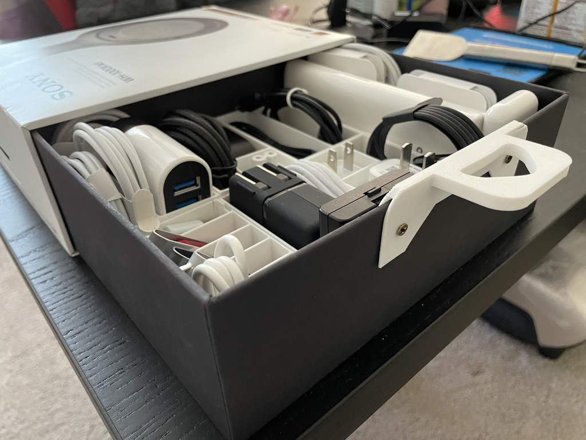
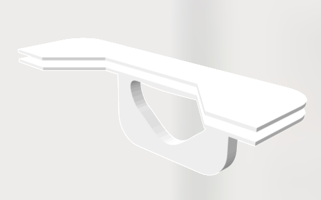
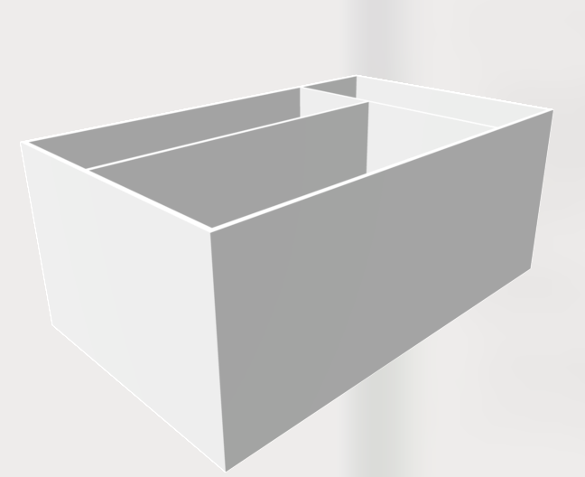
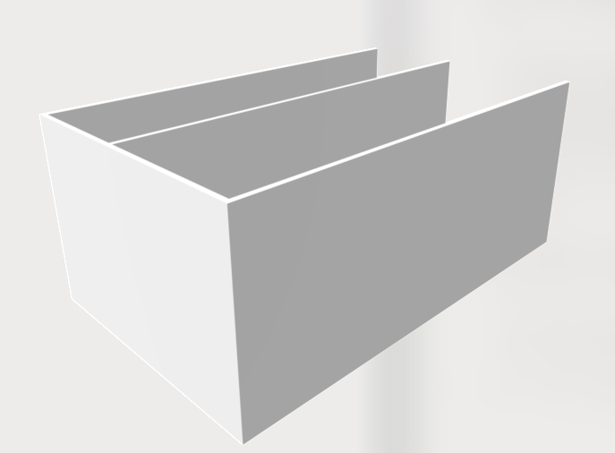
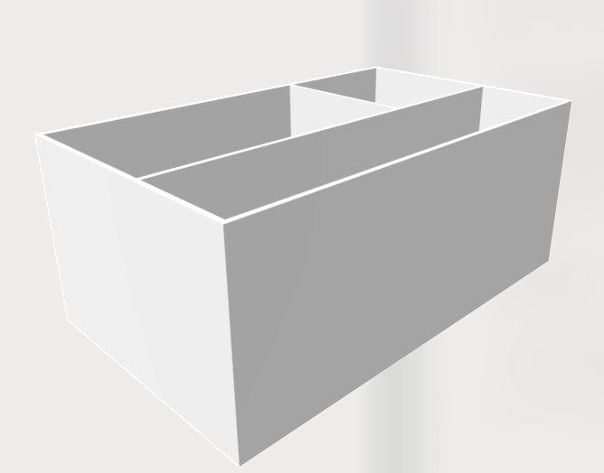
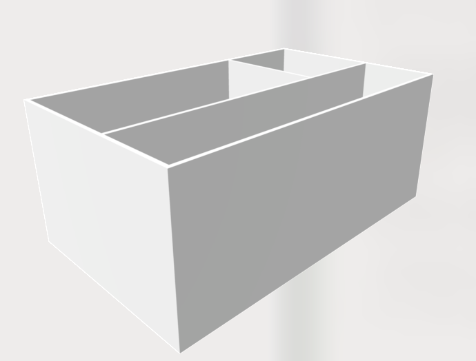
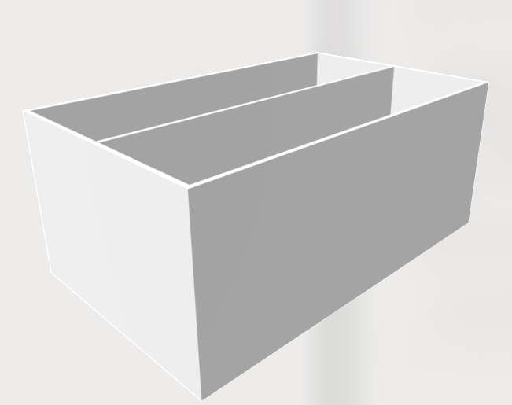

# Storage_Box_Organizer

This Box is used to hold Sony WH1000XM3. The dimension of the box should be 223 x 183 x 75 mm. 

[👉Buy Sony WH1000XM3 here👈](https://www.amazon.com/Sony-Noise-Cancelling-Headphones-WH1000XM3/dp/B07G4MNFS1?th=1)

This thing was creadted by Lihao Guo.

## Handle

<a href="3dprint/Storage_box_organizer/handle.STL" >👉Download here👈</a>

## Part 1

<a href="3dprint/Storage_box_organizer/L1.STL" >👉Download here👈</a>

## Part 2

<a href="3dprint/Storage_box_organizer/L2.STL" >👉Download here👈</a>

## Part 3

<a href="3dprint/Storage_box_organizer/L3.STL" >👉Download here👈</a>

## Part 4

<a href="3dprint/Storage_box_organizer/L4.STL" >👉Download here👈</a>

## Part 5

<a href="3dprint/Storage_box_organizer/L5.STL" >👉Download here👈</a>

## Part 6

<a href="3dprint/Storage_box_organizer/L6.STL" >👉Download here👈</a>

## Part 7

<a href="3dprint/Storage_box_organizer/L7.STL" >👉Download here👈</a>

