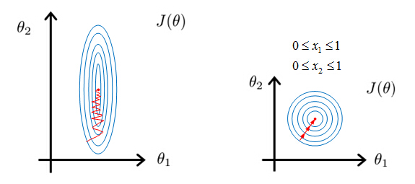

# 1/18/2021 AI面试百题训练营
|序号| 难度 | 题目 | 注意事项 |
|---|---|---|---|
| 1 | 简单 |  为什么要对特征做归一化?| 理解清楚特征归一化所适用的模型场景 |
| 2 | 中等 |  什么是组合特征？如何处理高维组合特征?| 这里的特征组合主要指的是类别特征(Categorical Feature)之间的组合 |
| 3 | 中等 |  请比较欧式距离与曼哈顿距离？|  比较曼哈顿距离和欧式距离的数值特点，并结合一两个具体例子做分析 |
| 4 | 中等 |  为什么一些场景中使用余弦相似度而不是欧式距离  | 比较余弦相似度和欧式距离的数值特点，并结合一两个具体例子做分析 |
| 5 | 中等 |  One-hot的作用是什么？为什么不直接使用数字作为表示 |    理解清楚并比较One-hot编码和数字编码的特点 |

## 为什么要对特征做归一化？

特征归一化是讲所有特征都统一到一个大致相同的数值区间内，通常为[0,1]。常用的特征归一化方法有:
- Min-Max Scaling
+ 对原始数据进行线性变换，使结果映射到[0,1]的范围，实现对数据的等比例缩放。
+ $X_{norm}=\frac{X - X_{min}}{X_{max} - X_{min}}$
+ $X_min, X_max$分别为数据的最小值和最大值
- Z-Score Normalization
+ 讲原始数据映射到均值为0，标准差为1的分布上。
+ $X_{norm} = \frac{X-\mu}{\sigma}$
+ $\mu$为原始特征的均值
+ $\sigma$为原始特征的标准差

上图显示了模型的收敛过程：特征未归一化 与 特征归一化

梯度更新的学习方法有 线性回归，逻辑回归，支持向量机，神经网络等。
在采用基于梯度更新的学习方法时，对模型的求解过程中，未归一化的数值特征在学习时梯度下降较为抖动，模型难以收敛。通常需要较长时间模型才能收敛。而归一化后的数值特征规则可言使用梯度下降较为稳定，进而减少梯度下降的次数，也更容易收敛。

## 什么是组合特征？ 如何处理高维组合特征？

- Categorical feature 狭义的组合特征即将类别特征
+ 两个或者多个特征的组合成的高阶组合特征。（数学里面的组合概念）
- 例子：假设Mac笔记本电脑的CPU型号和SSD大小 会对购买行为产生影响。

<table>    
    <thead>
        <tr>
            <td colspan = 5>笔记本电脑的CPU型号和SSD大小对购买行为的影响</td>
        </tr>
    </thead>
    <tbody>
        <tr>
            <td rowspan=2>是否购买</td>
            <td colspan=2>CPU型号</td>
            <td colspan=2>SSD大小</td>
        </tr>
        <tr>
            <td>Intel i5</td>
            <td>Intel i7</td>
            <td>256GB</td>
            <td>512GB</td>
        </tr>
        <tr>
            <td>1</td>
            <td>1</td>
            <td>0</td>
            <td>1</td>
            <td>0</td>
        </tr>
        <tr>
           <td>0</td>
           <td>0</td>
           <td>1</td>
           <td>1</td>
           <td>0</td>
       </tr>
       <tr>
         <td>0</td>
         <td>1</td>
         <td>0</td>
         <td>0</td>
         <td>1</td>
     </tr>
     <tr>
         <td>1</td>
         <td>0</td>
         <td>1</td>
         <td>0</td>
         <td>1</td>
     </tr>
 </tbody>
</table>

<table>
    <thead>
        <tr>
            <td colspan = 5>CPU与SSD组合特征对购买行为的影响</td>
        </tr>
    </thead>
    <tbody>
        <tr>
            <td rowspan=2>是否购买</td>
            <td colspan=4>CPU与SSD组合特征</td>
        </tr>
        <tr>
            <td>CPU = Intel i5  SSD = 256GB</td>
            <td>CPU = Intel i7  SSD = 256GB</td>
            <td>CPU = Intel i5  SSD = 512GB</td>
            <td>CPU = Intel i7  SSD = 512GB</td>
        </tr>
        <tr>
            <td>1</td>
            <td>1</td>
            <td>0</td>
            <td>1</td>
            <td>0</td>
        </tr>
        <tr>
           <td>0</td>
           <td>0</td>
           <td>1</td>
           <td>1</td>
           <td>0</td>
       </tr>
       <tr>
         <td>0</td>
         <td>1</td>
         <td>0</td>
         <td>0</td>
         <td>1</td>
     </tr>
     <tr>
         <td>1</td>
         <td>0</td>
         <td>1</td>
         <td>0</td>
         <td>1</td>
     </tr>
 </tbody>
</table>

- 组合特征的唯一值数量(Number of unique values)是单个特征的不同取值个数的乘积。
- 假设数据的特征向量为 $X = (x_1,x_2,...,x_k)$
    - $|<x_i,x_j>|= |x_i|*|x_j|$
    - $<x_i,x_j>$为$x_i,x_j$的组合特征
    - $x_i$表示特征$x_i$唯一值的个数
    - $x_j$表示特征$x_j$唯一值的个数

#### 逻辑回归来拟合特征时，公式为

$Y = sigmoid(\sum_i \sum_j w_{ij} <x_i,x_j>)$
- 参数$w_{ij}$的长度为$|<x_i,x_j>|$
- 参数长度为 $|x_i| \times |x_j| = m \times n$
- 当 m 和 n 非常大时，特征组合后的模型就会变得非常复杂。

这里引入一个概念叫Feature Embedding
- What is embedding?
    + Translate large sparse vectors into a lower-dimensional space that preserves semantic relationships $^1$
- [参考知乎 Feature Embedding](https://zhuanlan.zhihu.com/p/164385494)

1. Google public MLCC  https://developers.google.com/machine-learning/crash-course/embeddings/motivation-from-collaborative-filtering

如果模型特征长度非常大,那么可以采用Feature Embedding用低维向量来表示，那么就能降低学习参数的规模大小了。

## 比较欧式距离与曼哈顿距离

- Euclidean Distance
    - [Wikipedia](https://en.wikipedia.org/wiki/Euclidean_distance)
- Taxicab geometry / Manhattan distance
    - [Wikipedia](https://en.wikipedia.org/wiki/Taxicab_geometry)

在基于地图，导航等应用中，欧氏距离表现的理想化。 和现实上的距离相差较大，相比较曼哈顿距离较为合适。
欧氏距离根据各个维度上的距离自动得给每个维度计算了一个 `贡献权重`. 这个权重会因为各个维度的距离变化而动态变化。而曼哈顿距离的每个维度对最终的距离都有同样的贡献权重。

[1] [知乎 欧氏距离和余弦相似度的区别是什么？](https://www.zhihu.com/question/19640394)

## 为什么一些场景中使用余弦相似度而不是欧式距离
即两个向量夹角的余弦，关注的是向量之间的角度关系，并不关心他们的绝对大小，其取值范围是[-1,1]。当一对文本相似度的长度差距很大、但内容相近时，如果使用词频或者词向量作为特征，他们在特征空间中欧式距离通常很大；而如果使用余弦相似度的话，他们之间的夹角可能很小，因而相似度很高。此外，在文本、图像、视频等领域，研究的对象的特征维度往往很高，余弦相似度在高维情况下依然保持相同时为1，正交时为0，相反时为-1的性质，而欧式距离的数值则受维度的影响，范围不固定，并且含义也比较模糊。

[1] 算法新球. [模型评估一.](https://www.jianshu.com/p/605821698ae4)(visited on 1/18/2021)

[2] osc_p6dyctjv. [百面机器学习02-模型评估.](https://www.mdeditor.tw/pl/p7eJ)(visited on 1/18/2021)

[3] 努力学习AI的Qi. AI09 [余弦距离的应用.](https://www.aiastro.top/2019/07/ai09-%E4%BD%99%E5%BC%A6%E8%B7%9D%E7%A6%BB%E7%9A%84%E5%BA%94%E7%94%A8/)(visited on 1/18/2021)

## One-hot的作用是什么

[Wikipedia One-hot](https://zh.wikipedia.org/wiki/One-hot)

One-hot 主要用来编码类别特征，即采用哑变量(dummy variables) 对类别进行编码。它的作用是避免因将类别用数字作为表示而给函数带来抖动。

!>直接使用数字会给将人工误差而导致的假设引入到类别特征中，比如类别之间的大小关系，以及差异关系等等。

