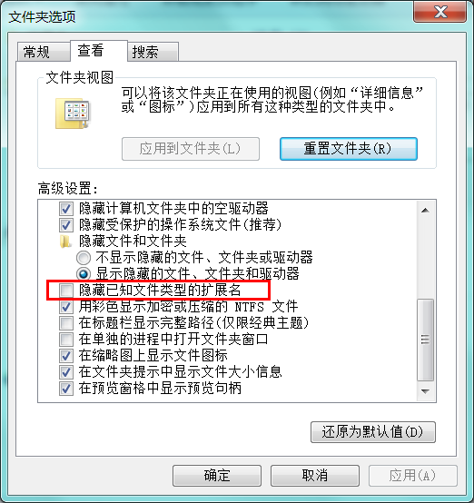
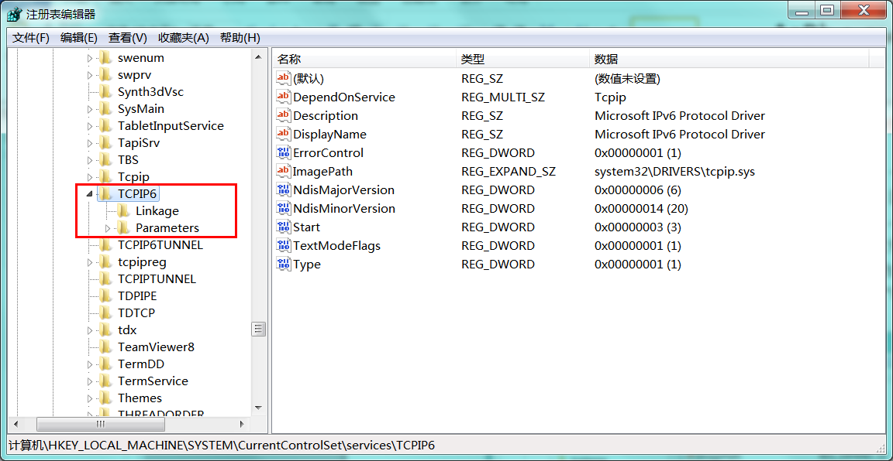

# 使用注册表文件（REG）添加、修改或删除Windows注册表项和值

## 简介

传统方式修改注册表采用 `Win+R` 输入 `regedit` 打开注册表编辑器，找到需要修改的地方进行修改。 当要修改好几台电脑的时候，就会感到麻烦和复杂。

REG是一种注册脚本文件,Regedit注册表编辑器可以使用REG文件来导入、导出注册表的子项和值。并且REG文件可以使用任何文本编辑进行修改，熟悉REG可以起到事半功倍的效果。

## 创建REG文件

REG文件的创建过程非常简单，可以通过任何一个文本文件编辑工具来实现。创建前记得先去掉“文件夹选项”中的“隐藏已知文件类型的扩展名”子项，使得你能够真正地修改文件的扩展名。

[]

我们以记事本为例，打开记事本程序，选择“另存为”，文件名为“SpecialPollInterval.reg”，保存类型为“所有文件”.

双击执行该文件会弹出以下提示框，提示是否需要修改注册表。
[]

### 注册表缩短时间同步间隔

Windows有Internet时间同步机制，可以与time.windows.com做时间校准（如果愿意，你可以改成别的），默认的周期是一周一次。这个周期对我来说有点略长， 我想改为十分钟sync一次。

1. 按 Win + R 组合键，打开运行，并输入 `regedit` ，按确定或回车，打开注册表编辑器
2. 在注册表编辑器中依次展开： HKEY_LOCAL_MACHINE\SYSTEM\CurrentControlSet\Services\W32Time\TimeProviders\NtpClient ，在窗口右侧列表中找到 SpecialPollInterval 
3. 双击并打开 SpecialPollInterval ，编辑 DWORD (32 位)值 ，将数值数据 604800 改成十进制的 86400 ，这里原本的 604800 是7天的秒数，换成 86400 则是一天的秒数；
4. 在右侧空白处新建DWORD值，并命名为 SpecialInterval ；
5. 双击打开新建的 SpecialInterval，编辑 DWORD(32位)值 的数值数据为1，最后点击确定即可；

```reg
Windows Registry Editor Version 5.00

 

[HKEY_LOCAL_MACHINE\SYSTEM\CurrentControlSet\Services\W32Time\TimeProviders\NtpClient]

"SpecialPollInterval"=dword:00000258
"SpecialInterval"= dword:00000001
```

这里DWORD `0000258` 为16进制 等于 10进制的 `600` 为 60秒×10分钟 = 600秒。

[下载文件](https://usleolihao.github.io/docs/zh-cn/notes/reg/SpecialPollInterval.reg)

## REG语法

Reg文件内容的基本语法格式如下：

```reg
RegistryEditorVersion

空行

[RegistryPath1]

"DataItemName1"="DataType1:DataValue1"

"DataItemName2"="DataType2:DataValue2"

空行

[RegistryPath2]

"DataItemName3"="DataType3:DataValue3"

空行

[RegistryPath3]

"DataItemName4"="DataType4:DataValue4"
```

- `RegistryEditorVersion`为Windows注册表编辑器的版本号。在Windows 2000、Windows XP、Windows Server 2003、Windows Vista、Windows 7中，其值为“Windows Registry Editor Version 5.00”。我的系统为Windows 7 Service Pack 1（64位），其值为“Windows Registry Editor Version 5.00”。在Windows 98和Windows NT 4.0中，其值为“REGEDIT4”。Windows 2000、Windows XP和Windows Server 2003可能还兼容“REGEDIT4”。

- `空行`用于分隔多个键路径，每个键路径下可以有多个子键和值项。

- `RegistryPath`就是键路径，包含在方括号中，并以反斜杠分隔每个层次结构，例如：
```reg

[HKEY_LOCAL_MACHINE\SYSTEM\CurrentControlSet\services\TCPIP6]
```
REG支持递归创建新的键（子键），只要在RegistryPath中加入想创建的键（子键）即可。例如使用如下语句在TCPIP6下创建子键try，并在try下创建子键abc。
```reg
Windows Registry Editor Version 5.00

[HKEY_LOCAL_MACHINE\SYSTEM\CurrentControlSet\services\TCPIP6\try\abc]
```

注册表由键（或称“项”）、子键（或称“子项”）和值项构成。我们来看一下注册表编辑器，浏览至上述键路径所指示的位置：
- 左侧展开的层次结构就是键路径，可以理解为目录，一个键就是分支中的一个目录，而子键就是这个目录中的子目录。子键同样是一个键，因为子目录下还可以有子目录。下图中的“TCPIP6”和“Linkage”就是键（子键）。
- 右侧的“名称-类型-数据”就是值项，可以理解为文件，一个键（子键）可以有一个或多个值项，其名称各不相同，如果一个值项的名称为空，则该值项为该键的默认值项。下图中的“DependOnService”就是值项的名称，“REG_MULTI_SZ”是值类型，其值为“Tcpip”。
[]

- `DataItemName`是值项的名称。如果该值项在注册表中不存在，则创建；如果存在，则覆盖其值。注意，值项的名称要用双引号引起来。

- `DataType、DataValue`是值项的值，其中DataType为值类型，DataValue为具体值，DataType和DataItemName之间用“=”连接。REG_SZ类型的值需要标明DataType值类型，只需要用双引号引起来，例如"DataItemName1"="Microsoft IPv6 Protocol Driver"；其他类型不需要用双引号引起来，但需要添加值类型，值类型和具体值之间用冒号分隔，例如"DataItemName2"=hex(2):73,00,79,00,73,00,74,00，"DataItemName3"=hex(7):5c,00,44,00,65,00,76,00，"DataItemName4"=dword:00000006。

| 显示类型       |数据类型 	  | 说明 		 |
| --------------| ------------|----------- |
| REG_BINARY    | 二进制数     |二进制值，以十六进制显示 |
| REG_DWORD   	| 双字        |一个32位的二进制值，显示为8位的十六进制值，也可显示为10位十进制值 |
| REG_SZ   		| 字符串      |文本字符串|
| REG_EXPAND_SZ | 可扩充字符串 ||
| REG_MULTI_SZ  | 多字符串    |含有多个文本值的字符串|

此外，注册表还有其他的数据类型，但是均不常用
- REG_DWORD_BIG_ENDIAN
- REG_DWORD_LITTLE_ENDIAN
- REG_FULL_RESOURCE_DESCRIPTOR
- REG_QWORD
- REG_FILE_NAME

### 删除操作语法

如果要删除一个键（子键），只需要在RegistryPath头部添加字符“-”即可。例如使用如下语句删除上文中创建的子键try和abc，REG是支持递归删除的。

```reg
Windows Registry Editor Version 5.00

[-HKEY_LOCAL_MACHINE\SYSTEM\CurrentControlSet\services\TCPIP6\try]
```

如果要删除一个值项，只需要在DataItemName后面的等号后添加字符“-” 即可。例如先使用下面第一段语句创建一个值项“valueItem”，然后用第二段语句删除该值项。
```reg
Windows Registry Editor Version 5.00

[HKEY_LOCAL_MACHINE\SYSTEM\CurrentControlSet\services\TCPIP6\try\abc]

"valueItem"=-
```

###  重命名操作语法 

若要重命名键（子键）或值项，请先将其删除，然后使用新的名称创建一个新的键（子键

## 补充知识

注册表有五个分支，下面是这五个分支的名称及作用：

- HKEY_CLASSES_ROOT
	- 存储Windows可识别的文档类型的详细列表，以及相关联的程序
- HKEY_CURRENT_USER
	- 存储当前用户设置的信息
- HKEY_LOCAL_MACHINE
	- 包括安装在计算机上的硬件和软件的信息
- HKEY_USERS
	- 包含使用计算机的用户的信息
- HKEY_CURRENT_CONFIG
	- 这个分支包含计算机当前的硬件配置信息