# Windows 时间服务工具和设置

## 还原时间服务注册表

如果已经修改过时间服务注册表，可以通过以下步骤还原注册表，不需还原则可以跳过这一步骤。

1) 打开控制面板 -> 日期和时间 -> Internet时间，点击更改设置，取消勾选与Internet时间服务器同步。

2) 重新注册时间同步服务,以管理员身份运行命令提示符。
```cmd
w32tm /unregister
w32tm /register
```
3) 设置Windows Time服务为自动启动

按Win+R打开运行对话框，输入services.msc，在服务列表中找到Windows Time，设置为自动。

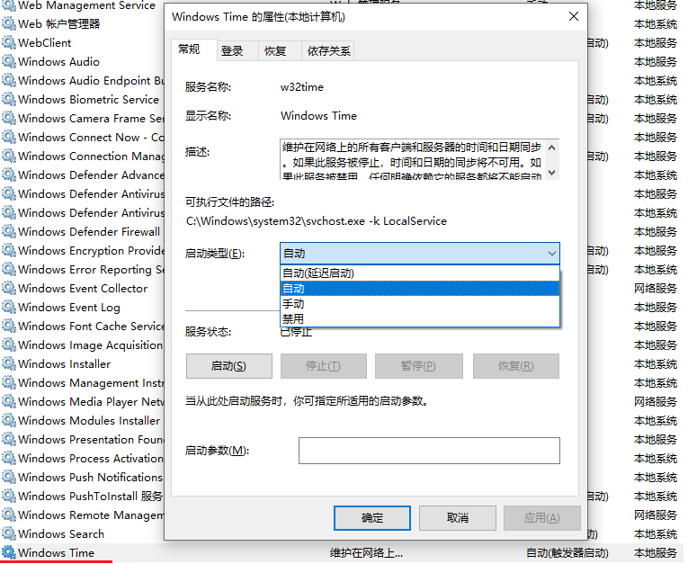

4）重新激活时间同步服务，并测试时间同步是否成功。

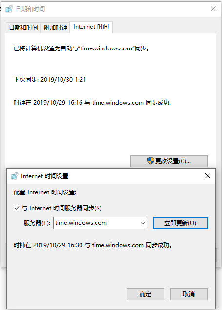


## 配置NTP时间同步服务器

1）打开组策略编辑器

打开运行对话框，输入gpedit.msc，打开组策略编辑器。

2）设置全局配置

找到“计算机配置 -> 管理模板 -> 系统 -> Windows 时间服务”，打开全局配置设置，设为“已启用”。设置AnnounceFlags的参数为5，标记该计算机为可靠时间服务器。

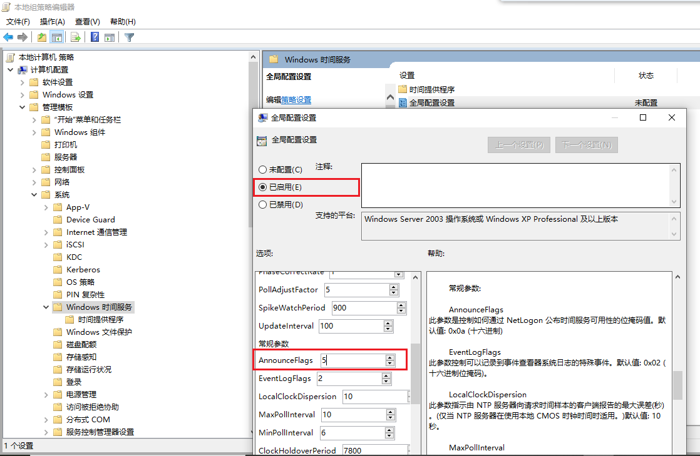

3）启用NTP时间同步服务器

找到“计算机配置 -> 管理模板 -> 系统 -> Windows 时间服务 -> 时间提供程序”，打开启用Windows NTP服务器，设置为已启用。

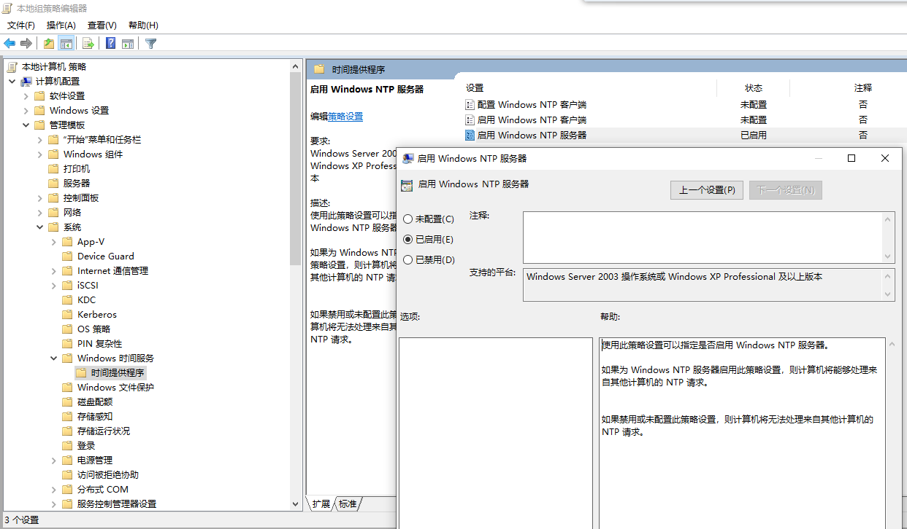

4）重启时间服务

按Win+R打开运行对话框，输入services.msc，在服务列表中找到Windows Time，右键点击，选择重新启动。

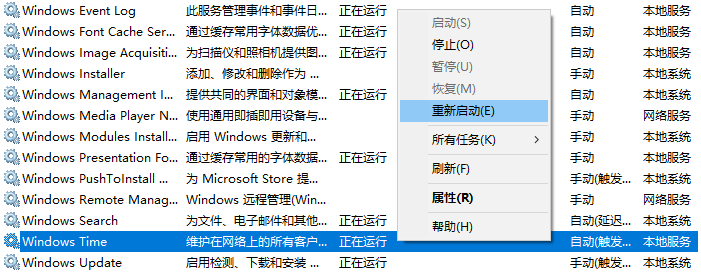

5）开放NTP端口

NTP协议所用的端口为UDP 123，在防火墙中开放UDP协议的123端口。

打开控制面板 -> Windows Defender 防火墙 -> 高级设置 -> 入站规则，点击新建规则。

选择“端口”，选择UDP，在特定本地端口中输入123, 选择允许连接,命名为Open NTP port。

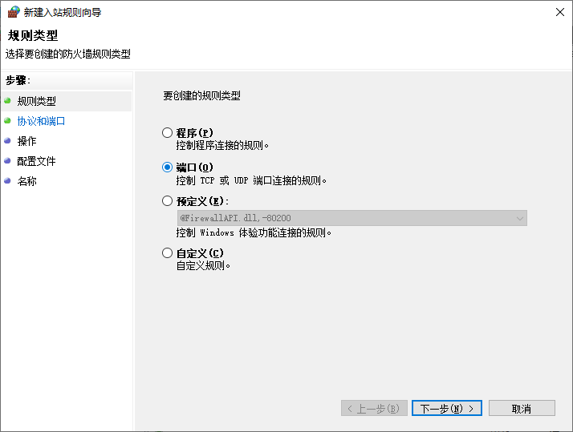

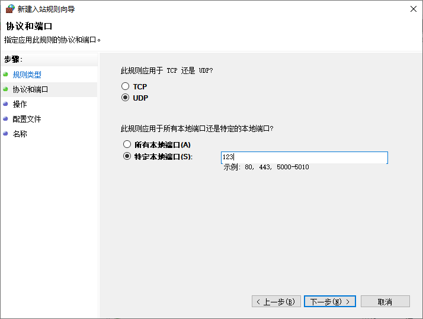

## 配置NTP时间同步客户端

1）设置时间服务器IP
打开控制面板 -> 日期和时间 -> Internet时间，点击更改设置，勾选与Internet时间服务器同步，填入NTP服务器的IP，点击“立即更新”可测试能否同步成功。

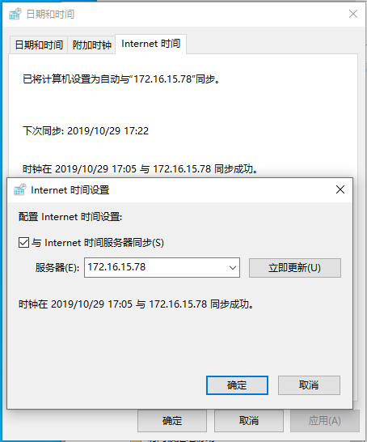

2）修改客户端时间同步周期
打开运行对话框，输入gpedit.msc，打开组策略编辑器。

找到“计算机配置 -> 管理模板 -> 系统 -> Windows 时间服务”，打开全局配置设置，设为“已启用”，不需修改参数。

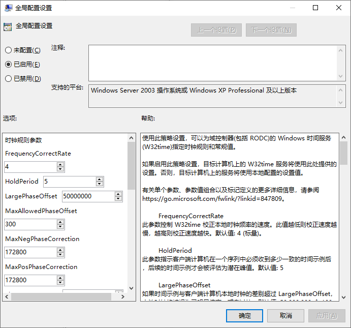

找到“计算机配置 -> 管理模板 -> 系统 -> Windows 时间服务 -> 时间提供程序”，打开配置Windows NTP客户端，设置为已启用。

- IP设置为与第一步相同的NTP服务器IP，IP之后的“,0x9”需要保留。
- 类型选择AllSync，表示即可与NTP同步，也可与域同步。
- SpecialPollInterval参数设置同步周期，单位为秒，设置为600秒即为10分钟同步一次。

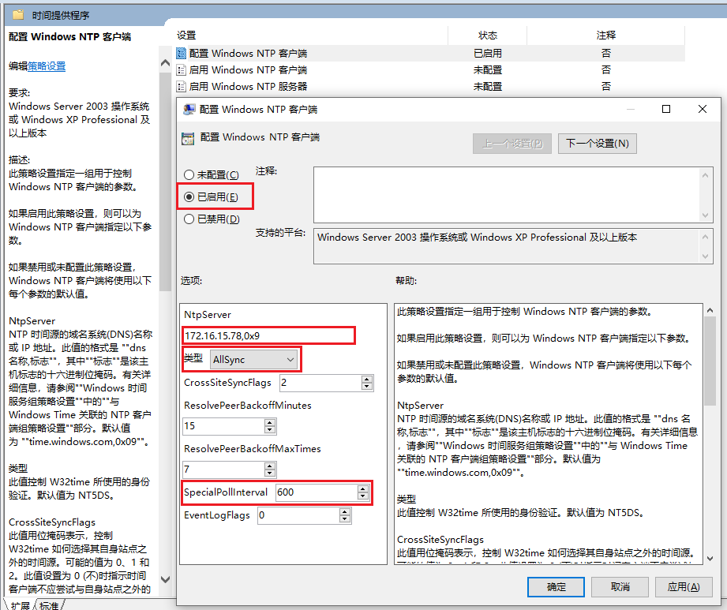

如下，同步时间已变为10分钟同步一次

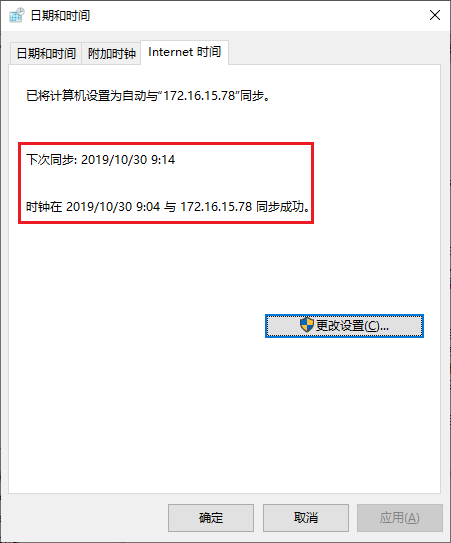

---

[1] 文章转自博客园，作者为星墨. [点击跳转原文.](https://www.cnblogs.com/yada/p/11757671.html)
